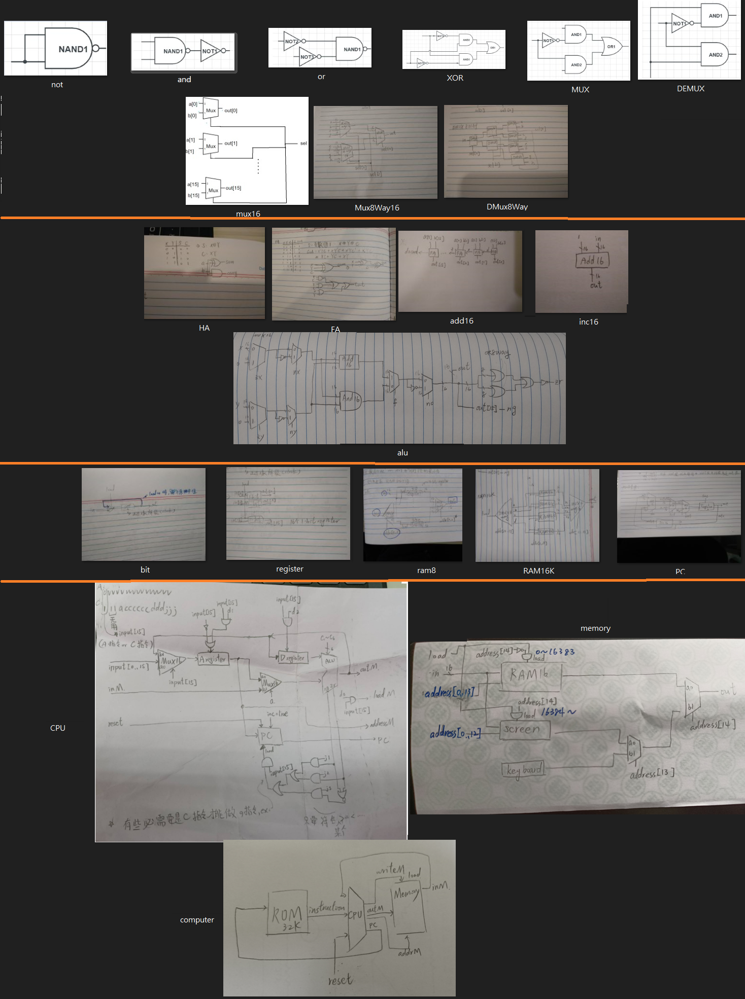
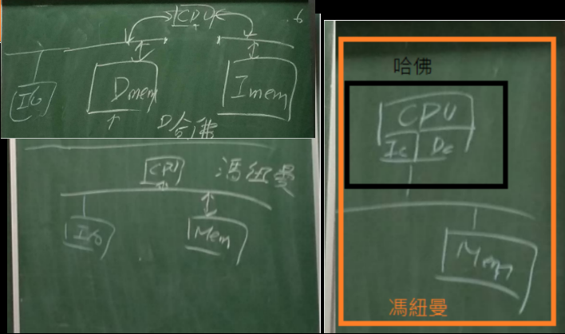
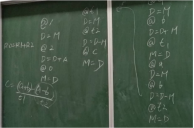
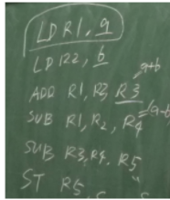

# 補充教材學習報告
你已經從 nand2tetris 學會如何做一台最簡易電腦，但現代電腦更快速複雜，主要的議題是速度：
如何設計電腦 -- 還有讓電腦變快的那些方法 (Slideshare)
x86 處理器 -- https://gitlab.com/ccc110/co/-/tree/master/x86/01-asm
RISC-V 處理器 -- https://riscv.org/technical/specifications/
學完這些請針對 nand2tetris+速度議題+ RISC-V （或 x86 ...) 寫一份報告！
---
# 目錄 : 
0. 在nand2tetris學會的事  
1. 前導知識
快取_cache  
CPU架構  
2. 在老師的簡報中提到  
	* 1.HackCPU中的ALU中的add16(漣波進位加法器)要變成前瞻進位加法器  
    * 2.透過cache減少存取慢速元件的機會  
    * 3.多層次快取  
    * 4.register增加  
    * 5.運用平行技術--多個元件同時執行，達成加速  
		i. pipeline管線機制  
			a.解釋  
			b.pipeline”冒險”  
		ii. 多核心+hyperthreading  
			a.亂序執行  
			b.多核心  
		 	c.hyperthreading超執行序  
		iii. 螢幕繪圖給GPU用  
    * 6.直接用特製電腦  
3. RISC-V  
    * 1.1前導知識-指令集  
    * 1.2前導知識-微架構  
    * 1.3前導知識-ISA(指令集架構)  
	    a.解釋  
	    b.计算机架构师在设计ISA时的基本考量  
		    i.性能  
		    ii.程序大小  
    * 1.4前導知識-RISC V  
    * 2.RV32I：RISC-V基础整数指令集  
	    a.RISC-V的基本ISA  
	    b.語法舉例  
4. 參考資料 

# 0.在nand2tetris學會的事
從最基本的邏輯閘，逐漸建構出一台簡易computer硬體+螢幕鍵盤乘法的組合語言運作邏輯。

# 1.前導知識
## 快取_cache : 
早期電腦CPU直接存取記憶體，由於CPU的執行速度一般比主記憶體的讀取速度快，存取主記憶體儲器所需要的時間為數個時鐘周期。若要存取主記憶體，就必須等待數個CPU周期 從而造成浪費。

cache : 存取速度比一般隨機存取記憶體（RAM）快的一種RAM

      →  現代CPU處理資料時，它會先到Cache中去尋找，如果資料因之前的操作已經讀取而
被暫存其中，就不需要再從隨機存取記憶體（Main memory）中讀取資料——

_取自維基百科
## CPU架構 : 
	馮紐曼架構:指令與變數都存在資料記憶體內
哈佛架構:指令與變數是存在不同記憶體內(指令記憶體與資料記憶體)
現代2021CPU都是混和型的:

# 2.在老師的簡報中提到

1.HackCPU中的ALU中的add16(漣波進位加法器)要變成前瞻進位加法器

2.透過cache減少存取慢速元件的機會

i.如果指令執行時，常存取不在cache的資料，cache就無效-->一次載入一塊區域，而
   且區域要選得好
	區域性的解釋 :
//好的區域性
for(i=0;i<10000;i++)
    for(j=0;j<10000;j++)
      m[i][j] = a[i][j]
//不好的區域性
for(j=0;j<10000;j++)
    for(i=0;i<10000;i++)
      m [ i ] [ j ] = a[i][j]
左邊記憶體儲存陣列的方式 :
00
01
02
10
11
12
a[0][0]
a[0][1]

右邊記憶體儲存陣列的方式 :
00
01
02
10
11
12
a[0][0]

a[1][0]

右邊因為每輪都跳為度大的(i)，導致記憶體存取位置都會跳比較遠，不連續導致的區域性快取失誤
若記憶體區域快取為00 01 02，那右邊會一直讓記憶體區域快取失效，因為讀取值容易不在快取區域內(每次位置都跨太多)

    
3.多層次快取
	(越快的快取越貴，取個成本平衡?)
大部分電腦中的記憶體階層如下四層：
      暫存器(可能是最快的存取)、快取、主記憶體、磁碟儲存
其中快取分四層: 
   （L1-L3：SRAM、L4：DRAM）
   （L1）–通常存取只需要幾個週期，通常是幾十個KB。
   （L2）–比L1約有2到10倍較高延遲性，通常是幾百個KB或更多。
   （L3）–比L2更高的延遲性，通常有數MB之大。
   （L4）（不一定有）–CPU外部的DRAM，但速度較主記憶體高。
_取自維基百科

4.register增加

	nand2tetris指令及架構只有一個A register 一個D register可以用,所以過程中我要不斷
把D空出來,所以過程中要不斷把上一個D先放入記憶體中,效能低

較現代的CPU(似RISC-V)的c=(a+b)-(a-b):
因為它不只A register D register 與PC
他有 : PC R0~R31,致使他需要下的指令會變少 (不用不斷把D空出來...)
不過register也不能用太多,因為你指令大小通常就32bit 可能不夠給甚麼 (SUB ADD 之類的指令碼)
_取自上課內容
5.運用平行技術--多個元件同時執行，達成加速

i. pipeline管線機制
         a.
	若处理器無pipeline结构，一条指令执行需要花费五个处理器周期来完成。

	fetch → decode → execute → access → write-back

		当处理器使用pipeline时，相当于执行一条指令时，每完成一个步骤，数据经过
一次锁存器(Latch)如电路图所示。
		(圖)
		
五個區域互不干擾，其面积开销较大，卻可以让不同的流水线级数同时做不同
事情。

提高了性能，优化了时序，增加了吞吐率

        b.
pipeline”冒險” : 

结构冒险：所需的硬件正在为之前的指令工作；
数据冒险：需要等待之前的指令完成数据写入；
控制冒险：需要根据之前的指令决定接下来的行为；
(平行動作還可能被跳躍指令打斷，資料不在第一集快取的問題
         _取自陳鍾誠簡報 : 如何設計電腦 -- 還有讓電腦變快的那些方法)

有一个万能的解决方案，就是执行空指令(流水線停頓)，使指令执行时间往后延迟。
ADD   R1,R2,R3
SUB   R4,R5,R3
其中ADD與SUB同時用到R3，屬結構冒險 : 所需的硬件正在为之前的指令工作，R3所存的值不能同時給ADD 與 SUB執行  (圖:)

從cycle2~cycle5每次都塞一個NOP，直到ADD運算完後釋出R3，才不再塞NOP並讓下一行指令SUB進行
又可畫為 : (圖:)
 

_取自知乎:不撑了不撑了

虽然流水线停顿能用来解决各种冒险，但它的效率低下(管線泡泡使
CPU無法權力運行)，應盡量避免

_取自cnblog:Rogn
	
ii. 多核心+hyperthreading
         a.亂序執行
		上方pipeline是以順序IO執行在討論，接著要討論亂序執行 : 

乱序执行OOO是指CPU采用了允许将多条指令不按程序规定的顺序分开发送给
各相应电路单元处理的技术。

		LDR R1, [R0]；
ADD R2, R1, R1； 
ADD R4，R3，R3;
單核 : 
cycle1 : LDR R1, [R0]
cycle2 : ADD R2, R1, R1
cycle3 : ADD R4，R3，R3
		雙核 : 
			cycle1 : LDR R1, [R0] // ADD R4，R3，R3 #不按順序 
cycle2 : ADD R2, R1, R1
越多核心，需的cycle會減少
_取自知乎:不撑了不撑了
	        b.多核心

		多核心中每個core都有自己的ALU，register，控制電路...，每個core皆能執行
指令

單核v.s.四核，最快能提升速度到四倍速

        c.hyperthreading超執行序

	多個core會共用一個記憶體，然同時間只能有一個core存取記憶體，然而存取
記憶體時core就會停下來，所以 

1. core上會加上catch去減少存取記憶體的動作

	2.讓一個core上有兩套register&相關電路 : 

一個core可以跑兩個thread，當使用中的register要去存取記憶體時(需
要很長時間)，就能換到另一個register，使CPU停不下來。
	
iii. 螢幕繪圖給GPU用
         
	GPU具有浮點乘法與加法的運算單元，螢幕繪製需要很多這類運算
         	GPU是一個core內有很多ALU，而多核心是每個core僅一個ALU

6.直接用特製電腦

	舉例 :

	     TPU 
		可以處理高維向量，可以一次運算一個矩陣相乘的結果(因為有個MPU，裡面
有256*256的加法與乘法運算單元)
		
      把特定演算法設計成快速硬體電路，
	ex:比特幣挖礦機(SHA256+平行)

# 3.RISC-V

前面提到的是關於整台電腦的加速，而這裡要特別探討CPU內部指令集的部分，簡易提及指令集的設計如何影響效能，與RISC-V的一些概念與語法

## 1.1前導知識-指令集

	电脑的部件需要CPU来指挥，而CPU内的部件也需要受到指挥协调才能工作，这个指
挥官就是程序。由程序发出的指挥CPU内部电路协同工作的命令，简称为指令。

例如，如果要让CPU完成一次A+B->C的计算，就要发2条存取指令，从存储器把A和B取出来送到运算器中；再发1条加法指令，让运算器执行加法运算；最后发1条存取指令，把C存入存储器。
这个例子中用到了两种指令：存取指令和加法指令。

实际上，一个通用CPU要完成各类计算、推理、判断和控制工作，它的指令种类少则
几十种，多则数百种，CPU的各种指令的集合称为CPU的指令集。
_取自芯论语 ，作者天高云淡Andi863
## 1.2前導知識-微架構
	
指令集需要有与之相适应的CPU硬件架构，这种硬件架构称为CPU的微架构
_參考自芯论语 ，作者天高云淡Andi863
## 1.3前導知識-ISA(指令集架構)
         a.
指令集架構包含一系列的操作碼(機器語言），以及由特定處理器執行的基本命令

包含了基本資料類型，指令集，暫存器，定址模式，儲存體系，中斷，異常處理以及外部I/O。

指令集體系(碼)與微架構(硬件)（一套用於執行指令集的微處理器設計方法）不同。使用不同微架構的電腦可以共享一種指令集。
		_取自wikipedia:指令集架構
         b.计算机架构师在设计ISA时的基本考量 :
成本（美元硬币）
简洁性（轮子）
性能（速度计）
架构和具体实现的分离（分开的两个半圆）
提升空间（手风琴）
程序大小（相对的压迫着一条线的两个箭头）
易于编程/编译/链接（儿童积木“像ABC一样简单”）
(圖)

	i.其中性能 
=(instruction/program)*(average clock cycle/instruction)*(time/clock cycle)
=平均每個程序的指令數*每條指令所需花的clock週期*平均時鐘週期=
=time/program 
=(單條program所需花的時間)

又，简单ISA可能在每个程序执行的指令数 > 复杂ISA，但它可以通过更快的时钟频率或更低的平均单条指令周期数（CPI）来弥补。

example : 
	自<<The RISC-V Reader中文版>>中擷取 :

运行CoreMark测试程序[Gal-On, Levy 2012]（100000次迭代）后，
ARM-32Cortex-A9對比RISC-V的BOOM实现的性能:(圖:)

ARM处理器执行的指令與RISC-V差不多，
而RISC-V处理器在这三个因素中(指令數,平均clock週期,總時間)的每一个都获得了近10%的优势，它们加起来导致了近30%的性能优势。

	ii.其中程序大小
		程序越小，存储它所需的芯片面积就越小。
更小的程序还能减少指令缓存的未命中问题(因為所佔記憶體大小比較小嗎?)，从而节省了功耗（因为片外DRAM访问比片上SRAM访问耗能更多），也提高了性能。

_參考自The RISC-V Reader中文版(David Patterson) v2p1.pdf

## 1.4前導知識-RISC V
	RISC类指令集(也稱精简指令集)
     _取自芯论语 ，作者天高云淡Andi863	
## 2.RV32I：RISC-V基础整数指令集

a.RISC-V的基本ISA
47种指令，6種指令格式(R,I,S,U,SB,UJ)
imm：立即数
rs1：源寄存器1
rs2：源寄存器2
rd：目标寄存器
opcode：操作码
31个通用整型register
	x1 ~ x31，皆32bit
x0被命名为常数0，它也可以被作为目标register用来舍弃指令执行的结果。
PC是registerx32。

b.語法舉例 : 
add rd,rs1,rs2;
R
rd← rs1 + rs2 後面兩個做運算存到前面那個
sub rd,rs1,rs2;
R
rd← rs1 - rs2
sll   rd,rs1,rs2;
R
rs1左移rs2格(向最左補rs2個0)後存到rd
srl  rd,rs1,rs2;
R
單純右移
sra rd,rs1,rs2;
R
算術右移 (即最左邊bit正負號不動，後面右移)
and  rd,rs1,rs2;
R

or  rd,rs1,rs2;
R

Xor  rd,rs1,rs2;
R

slt  rd,rs1,rs2;
R
rd ← (  rs2 > rs1  ?  1 : 0) 左>右則rd寫入1
set less than，將 rs1暫存器與 rs2暫存器當做 singed/unsigned number做比較，若 rs1暫存器小於 rs2暫存器，則將數值 1寫入 rd暫存器，反之則寫入數值 0。     _取自Jim's Dev Blog
sltu rd,rs1,rs2;
R
slt無號數版
addi rd, rs1, imm[11:0]
I
[rd] <- [rs1] + imm[11:0]
将12位有符号立即数和rs相加，溢出忽略，直接使用结果的最低32bit，并存入rd
_取自东方不白a
addi rd, rs1, 0 可被使用來當做 mov指令                                                _取自Jim's Dev Blog

  
_取自SunnyChen的小窝

# 4.參考資料
* 
[如何設計電腦-- 還有讓電腦變快的那些方法](https://www.slideshare.net/ccckmit/ss-85466673)  
* cache:  
[缓存- 维基百科，自由的百科全书](https://zh.wikipedia.org/wiki/%E7%BC%93%E5%AD%98)  
[記憶體階層_維基百科](https://zh.wikipedia.org/wiki/%E8%A8%98%E6%86%B6%E9%AB%94%E9%9A%8E%E5%B1%A4)  
* pipeline:  
[处理器中的流水线技术- 知乎](https://zhuanlan.zhihu.com/p/109574885)  
[605-数据冒险的处理- 第六讲流水线处理器 1:16之前，解釋pipeline空泡指令的用處(空指令)](https://www.coursera.org/lecture/jisuanji-zucheng/605-shu-ju-mou-xian-de-chu-li-Qr7TA)  
[计算机组成与设计（十）—— 流水线的冒险- Rogn - 博客园](https://www.cnblogs.com/lfri/p/10053598.html)講到結構冒險(所需的硬件正在为之前的指令工作)與冯诺依曼结构  
* 指令集:  
[一文看懂指令集是什么](https://picture.iczhiku.com/weixin/message1609469010232.html)  
[指令集架構- 维基百科，自由的百科全书](https://zh.wikipedia.org/wiki/%E6%8C%87%E4%BB%A4%E9%9B%86%E6%9E%B6%E6%A7%8B)  
* RISC-V :  
[https://pan.baidu.com/s/1qX9uKZa#list/path=%2Fsharelink236650608-516612036983521%2FRISC-V&parentPath=%2Fsharelink236650608-516612036983521](https://pan.baidu.com/s/1qX9uKZa#list/path=%2Fsharelink236650608-516612036983521%2FRISC-V&parentPath=%2Fsharelink236650608-516612036983521)_暖*暖  
 上下述網址皆為The RISC-V Reader中文版(David Patterson) v2p1.pdf來源  
[如何看待开源指令集RISC-V ? - 知乎](https://www.zhihu.com/question/28368960)  
[RISC-V基本指令集概述](http://www.sunnychen.top/2019/07/06/RISC-V%E5%9F%BA%E6%9C%AC%E6%8C%87%E4%BB%A4%E9%9B%86%E6%A6%82%E8%BF%B0/)  
[RISC-V 指令集架構介紹- RV64I](https://tclin914.github.io/464e7cd9/)  
[算术移位- 维基百科，自由的百科全书](https://zh.wikipedia.org/wiki/%E7%AE%97%E6%9C%AF%E7%A7%BB%E4%BD%8D)  
[RISC-V指令集介绍- 整数基本指令集](https://blog.csdn.net/zhangshuaiisme/article/details/80718496)  
* 沒用到的資料+看不懂的資料:  
[Hyper Thread超线程的种种- 知乎](https://zhuanlan.zhihu.com/p/58448264)  
[三分钟带你了解冯.诺依曼结构](https://zhuanlan.zhihu.com/p/136748306)  
[如何看待开源指令集RISC-V ? - 知乎](https://www.zhihu.com/question/28368960)  
[什么是指令集？CPU的指令集是怎么运作的？X86、ARM、MIPS、Alpha、RISC等有什么区别？ - 知乎用户的回答- 知乎](https://www.zhihu.com/question/423489755/answer/1500773312)  

