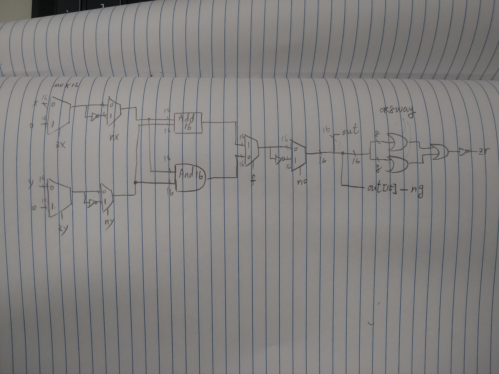

# ALU nostate
```hdl
CHIP ALU {
    IN  
        x[16], y[16],  // 16-bit inputs        
        zx, // zero the x input?
        nx, // negate the x input?
        zy, // zero the y input?
        ny, // negate the y input?
        f,  // compute out = x + y (if 1) or x & y (if 0)
        no; // negate the out output?

    OUT 
        out[16], // 16-bit output
        zr, // 1 if (out == 0), 0 otherwise
        ng; // 1 if (out < 0),  0 otherwise

    PARTS:
   // Put you code here:
   Mux16(a=x,b=false,sel=zx,out=zxout);
   Not16(in=zxout,out=notzxout);
   Mux16(a=zxout,b=notzxout,sel=nx,out=nxout);

   Mux16(a=y,b=false,sel=zy,out=zyout);
   Not16(in=zyout,out=notzyout);
   Mux16(a=zyout,b=notzyout,sel=ny,out=nyout);

   Add16(a=nyout,b=nxout,out=nxpny);
   And16(a=nyout,b=nxout,out=nxtny);

   Mux16(a=nxtny,b=nxpny,sel=f,out=xyptchoose);

   Not16(in=xyptchoose,out=nxyptchoose);

   Mux16(a=xyptchoose,b=nxyptchoose,sel=no,out=out);
}
```
# ALU 
```hdl
CHIP ALU {
    IN  
        x[16], y[16],  // 16-bit inputs        
        zx, // zero the x input?
        nx, // negate the x input?
        zy, // zero the y input?
        ny, // negate the y input?
        f,  // compute out = x + y (if 1) or x & y (if 0)
        no; // negate the out output?

    OUT 
        out[16], // 16-bit output
        zr, // 1 if (out == 0), 0 otherwise
        ng; // 1 if (out < 0),  0 otherwise

    PARTS:
   // Put you code here:
   Mux16(a=x,b=false,sel=zx,out=zxout);
   Not16(in=zxout,out=notzxout);
   Mux16(a=zxout,b=notzxout,sel=nx,out=nxout);

   Mux16(a=y,b=false,sel=zy,out=zyout);
   Not16(in=zyout,out=notzyout);
   Mux16(a=zyout,b=notzyout,sel=ny,out=nyout);

   Add16(a=nyout,b=nxout,out=nxpny);
   And16(a=nyout,b=nxout,out=nxtny);

   Mux16(a=nxtny,b=nxpny,sel=f,out=xyptchoose);

   Not16(in=xyptchoose,out=nxyptchoose);

   Mux16(a=xyptchoose,b=nxyptchoose,sel=no,out=out,out[0..7]=out1,out[8..15]=out2,out[15]=ng);

   Or8Way(in=out1,out=outOr1);
   Or8Way(in=out2,out=outOr2);
   Or(a=outOr1,b=outOr2,out=out3);
   Not(in=out3,out=zr);
}
```

