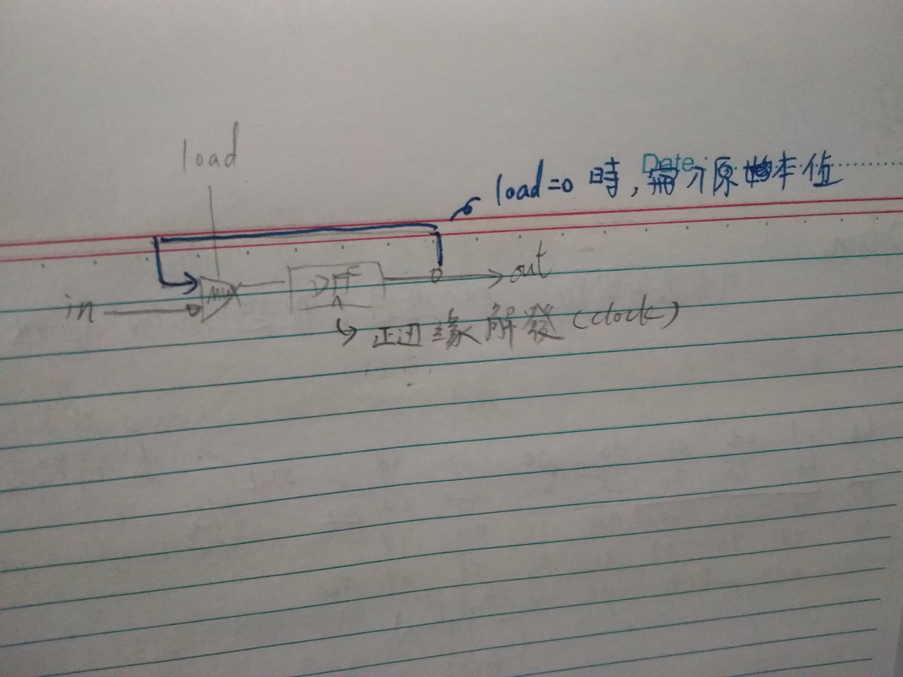
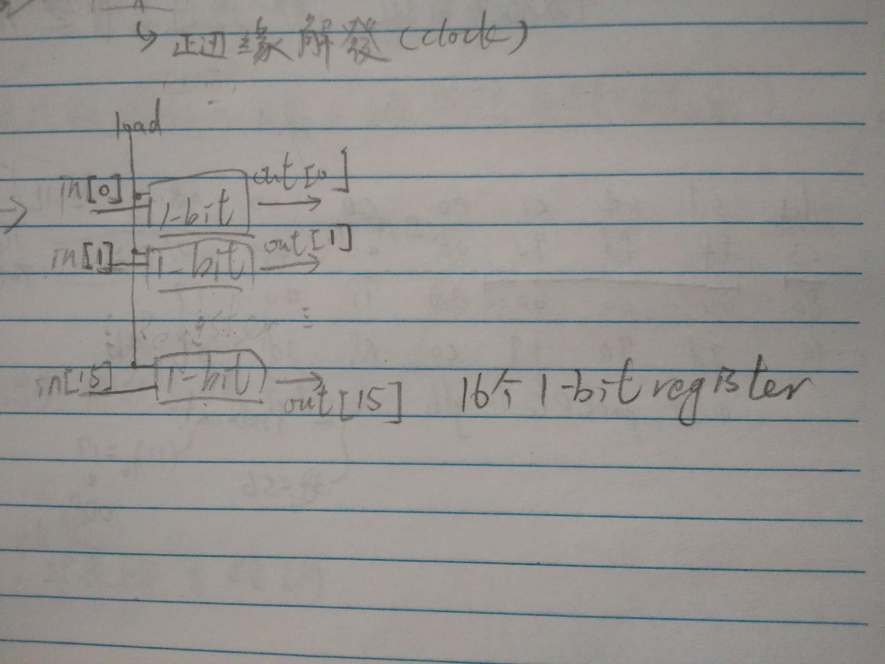
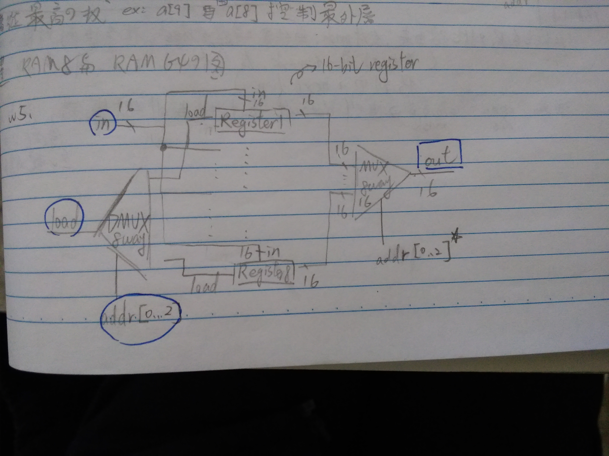

# Bit 
```hdl
CHIP Bit {
    IN in, load;
    OUT out;

    PARTS:
    // Put your code here:
    Mux(a=c,b=in,sel=load,out=muxout);
    DFF(in=muxout,out=out,out=c);
}
```

# Register 
```hdl
CHIP Register {
    IN in[16], load;
    OUT out[16];

    PARTS:
    // Put your code here:
    Bit(in=in[0],load=load,out=out[0]);
    Bit(in=in[1],load=load,out=out[1]);
    Bit(in=in[2],load=load,out=out[2]);
    Bit(in=in[3],load=load,out=out[3]);
    Bit(in=in[4],load=load,out=out[4]);
    Bit(in=in[5],load=load,out=out[5]);
    Bit(in=in[6],load=load,out=out[6]);
    Bit(in=in[7],load=load,out=out[7]);
    Bit(in=in[8],load=load,out=out[8]);
    Bit(in=in[9],load=load,out=out[9]);
    Bit(in=in[10],load=load,out=out[10]);
    Bit(in=in[11],load=load,out=out[11]);
    Bit(in=in[12],load=load,out=out[12]);
    Bit(in=in[13],load=load,out=out[13]);
    Bit(in=in[14],load=load,out=out[14]);
    Bit(in=in[15],load=load,out=out[15]);
}
```

# RAM8
```hdl
CHIP RAM8 {
    IN in[16], load, address[3];
    OUT out[16];

    PARTS:
    // Put your code here:
    DMux8Way(in=load,sel=address,a=a,b=b,c=c,d=d,e=e,f=f,g=g,h=h);  //8組輸出 每組16bit
    Register(in=in,load=a,out=R1);  //8個register 皆輸入16bit(1register由16bit組成)
    Register(in=in,load=b,out=R2);
    Register(in=in,load=c,out=R3);
    Register(in=in,load=d,out=R4);
    Register(in=in,load=e,out=R5);
    Register(in=in,load=f,out=R6);
    Register(in=in,load=g,out=R7);
    Register(in=in,load=h,out=R8);
    Mux8Way16(a=R1,b=R2,c=R3,d=R4,e=R5,f=R6,g=R7,h=R8,sel=address,out=out);
}
```

