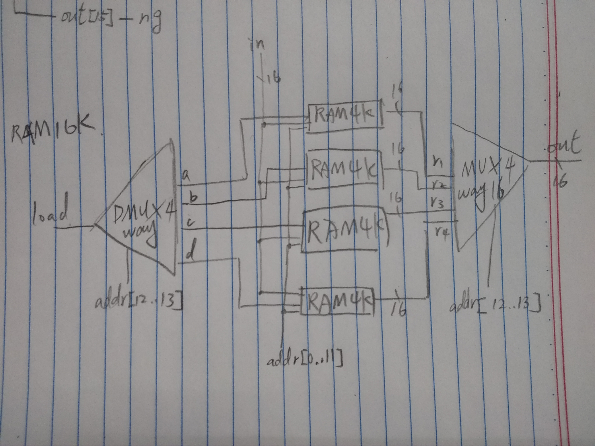

# RAM64
```hdl
CHIP RAM64 {
    IN in[16], load, address[6];
    OUT out[16];

    PARTS:
    // Put your code here:
    DMux8Way(in=load,sel=address[3..5],a=a,b=b,c=c,d=d,e=e,f=f,g=g,h=h);
    RAM8(in=in,load=a,address=address[0..2],out=r1);
    RAM8(in=in,load=b,address=address[0..2],out=r2);
    RAM8(in=in,load=c,address=address[0..2],out=r3);
    RAM8(in=in,load=d,address=address[0..2],out=r4);
    RAM8(in=in,load=e,address=address[0..2],out=r5);
    RAM8(in=in,load=f,address=address[0..2],out=r6);
    RAM8(in=in,load=g,address=address[0..2],out=r7);
    RAM8(in=in,load=h,address=address[0..2],out=r8);
    Mux8Way16(a=r1,b=r2,c=r3,d=r4,e=r5,f=r6,g=r7,h=r8,sel=address[3..5],out=out);
}
```

# RAM512
```hdl
CHIP RAM512 {
    IN in[16], load, address[9];
    OUT out[16];

    PARTS:
    // Put your code here:
    DMux8Way(in=load,sel=address[6..8],a=a,b=b,c=c,d=d,e=e,f=f,g=g,h=h);
    RAM64(in=in,load=a,address=address[0..5],out=r1);
    RAM64(in=in,load=b,address=address[0..5],out=r2);
    RAM64(in=in,load=c,address=address[0..5],out=r3);
    RAM64(in=in,load=d,address=address[0..5],out=r4);
    RAM64(in=in,load=e,address=address[0..5],out=r5);
    RAM64(in=in,load=f,address=address[0..5],out=r6);
    RAM64(in=in,load=g,address=address[0..5],out=r7);
    RAM64(in=in,load=h,address=address[0..5],out=r8);
    Mux8Way16(a=r1,b=r2,c=r3,d=r4,e=r5,f=r6,g=r7,h=r8,sel=address[6..8],out=out);
}
```

# RAM4K
```hdl
CHIP RAM4K {
    IN in[16], load, address[12];
    OUT out[16];

    PARTS:
    // Put your code here:
    DMux8Way(in=load,sel=address[9..11],a=a,b=b,c=c,d=d,e=e,f=f,g=g,h=h);
    RAM512(in=in,load=a,address=address[0..8],out=r1);
    RAM512(in=in,load=b,address=address[0..8],out=r2);
    RAM512(in=in,load=c,address=address[0..8],out=r3);
    RAM512(in=in,load=d,address=address[0..8],out=r4);
    RAM512(in=in,load=e,address=address[0..8],out=r5);
    RAM512(in=in,load=f,address=address[0..8],out=r6);
    RAM512(in=in,load=g,address=address[0..8],out=r7);
    RAM512(in=in,load=h,address=address[0..8],out=r8);
    Mux8Way16(a=r1,b=r2,c=r3,d=r4,e=r5,f=r6,g=r7,h=r8,sel=address[9..11],out=out);
}
```

# RAM16K
```hdl
CHIP RAM16K {
    IN in[16], load, address[14];
    OUT out[16];

    PARTS:
    // Put your code here:
    DMux4Way(in=load,sel=address[12..13],a=a,b=b,c=c,d=d);
    RAM4K(in=in,load=a,address=address[0..11],out=r1);
    RAM4K(in=in,load=b,address=address[0..11],out=r2);
    RAM4K(in=in,load=c,address=address[0..11],out=r3);
    RAM4K(in=in,load=d,address=address[0..11],out=r4);
    Mux4Way16(a=r1,b=r2,c=r3,d=r4,sel=address[12..13],out=out);
}
```

# PC
```hdl
CHIP PC {
    IN in[16],load,inc,reset;
    OUT out[16];

    PARTS:
    // Put your code here:
    Register(in=resetOut,load=true,out=out,out=out2);
    Inc16(in=out2,out=incOut);
    Mux16(a=out2,b=incOut,sel=inc,out=incMuxOut);
    Mux16(a=incMuxOut,b=in,sel=load,out=loadOut);
    Mux16(a=loadOut,b=false,sel=reset,out=resetOut);
}
```
