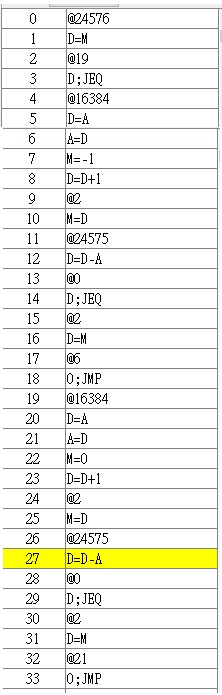

# Mult
結果顯示在M[2]
```hdl
@17     //0     R0輸入17
D=A     //1
@0     //2
M=D     //3
@5     //4         R1輸入5
D=A     //5
@1     //6
M=D     //7

@0                                                                                                         
D=M                                                                                    
@11        //R0存到M[11]                                                                      
M=D     
@1     
D=M       
@33         //r1為0要直接@2 D=M 
D;JEQ       
@22         //R1存到M[22]
M=D         
                             
@31     //Bfinish///@FINISH                                               
D;JEQ       //由R1--來算迴圈次數 //R1==0直接finish結束迴圈 (R0相加R1次)                        
@11     //Count                                             
D=M                                                         
@0                                                      
D=D+M       //D=D+D不是乘法的遞增                                                    
@11                                                            
M=D    //計算完成儲存結果                                       
@1    //扣迴圈次數                                             
M=M-1                                                                          
D=M-1                                                                
@18    //@Bfinish                                            
0;JMP                                                            
@11     //FINISH 把答案存到R2                                         
D=M                                                              
@2                                      
M=D                                 
@34                                      
0;JMP                                
```
# Fill
按下鍵盤螢幕全黑，不按下鍵盤螢幕白
```hdl
// Put your code here.
@24576  //FIRST 確認鍵盤是否按下
D=M
@19      //沒有按下就螢幕全亮
D;JEQ
@16384      //第一步
D=A
A=D     //rrr更新位置
M=-1    
D=D+1
@2
M=D     //存取D值
@24575
D=D-A
@0   //跑滿螢幕後重新執行偵測鍵盤
D;JEQ
@2      //讀取D值
D=M
@6     //重新執行
0;JMP
@16384      //CLEAR//第一步
D=A
A=D     //RRR更新位置
M=0    
D=D+1
@2
M=D     //存取D值
@24575
D=D-A
@0   //跑滿螢幕後重新執行偵測鍵盤
D;JEQ
@2      //讀取D值
D=M
@21     //重新執行
0;JMP
```
