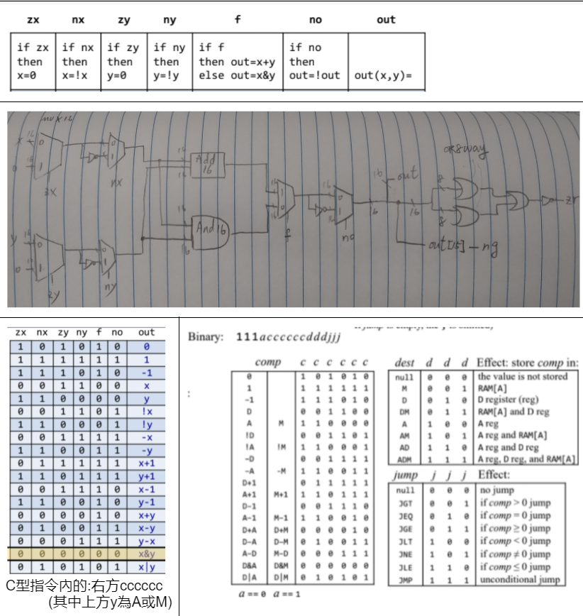
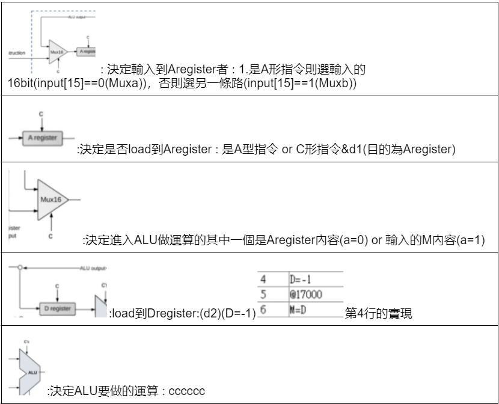
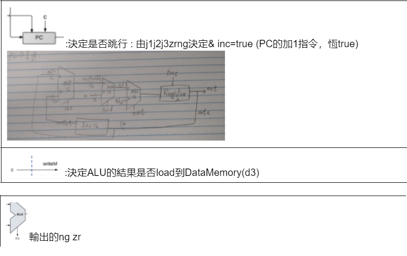
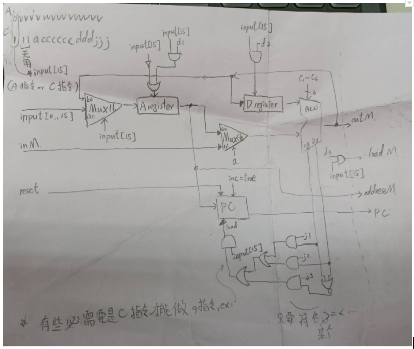

# CPU
## 參考資料
    NAND2Tetris(2)-Boolean Arithmetic and the ALU - 知乎
    (https://zhuanlan.zhihu.com/p/346512588)
    https://github.com/stereomp3/co110a/tree/master/homework/week08
## 一. ALU

## 二.輸入三條指令
    1.指令輸入16bit (A:0vvvvvvvvvvvvvvv C:111accccccdddjjj)
    2.輸入M的內容
    3.輸入reset

## 三.ALU zrng與jump指令判斷  (PC部分)
    j1 : < ,  j2 : = , j3 : > , 將j1j2j3組合(ex:<= 110)
    <  : c指令的 j1 & ng
    =  : c指令的 j2 & zr
    >  : c指令的 j3 & !(ng+zr)

## 四.ddd是甚麼 : 目的
    d1 : A register , d2 : D register , d3 : outM(CPU所輸出到的dataMemory)
## 五.探討每個C



```hdl
CHIP CPU {

    IN  inM[16],         // M value input  (M = contents of RAM[A])
        instruction[16], // Instruction for execution
        reset;           // Signals whether to re-start the current
                         // program (reset==1) or continue executing
                         // the current program (reset==0).

    OUT outM[16],        // M value output
        writeM,          // Write to M? 
        addressM[15],    // Address in data memory (of M)
        pc[15];          // address of next instruction

    PARTS:
    // Put your code here:
    //d1:instruction[15],a:instruction[12]
    Mux16(a=instruction,b=outM2,sel=instruction[15],out=toAreg);

    //ARegister
    Not(in = instruction[15],out=notC);
    And(a=instruction[15],b=instruction[5],out=andD1);
    Or(a=notC,b=andD1,out=loadAreg);
    ARegister(in=toAreg,load=loadAreg,out=outAreg,out[0..14]=addressM); //OUT addressM[15]

    Mux16(a=outAreg,b=inM,sel=instruction[12],out=toALU1);

    //Dregister
    And(a=instruction[15],b=instruction[4],out=loadDreg);
    DRegister(in=outM2,load=loadDreg,out=toALU2);

    //ALU
    ALU(x=toALU2, y=toALU1, zx=instruction[11], nx=instruction[10], zy=instruction[9], ny=instruction[8], f=instruction[7], no=instruction[6], out=outM2, out=outM, zr=zr, ng=ng);

    //loadM
    And(a=instruction[3],b=instruction[15],out=writeM);

    //PC
    Or(a=ng,b=zr,out=ngzrO);
    Not(in=ngzrO,out=ngzrN);
    And(a=instruction[2],b=ng,out=j1);
    And(a=instruction[1],b=zr,out=j2);
    And(a=instruction[0],b=ngzrN,out=j3);
    Or(a=j1,b=j2,out=j1orj2);
    Or(a=j1orj2,b=j3,out=jjj);
    And(a=jjj,b=instruction[15],out=loadPC);
    PC(in=outAreg, load=loadPC, inc=true, reset=reset, out[0..14]=pc);
}
```

