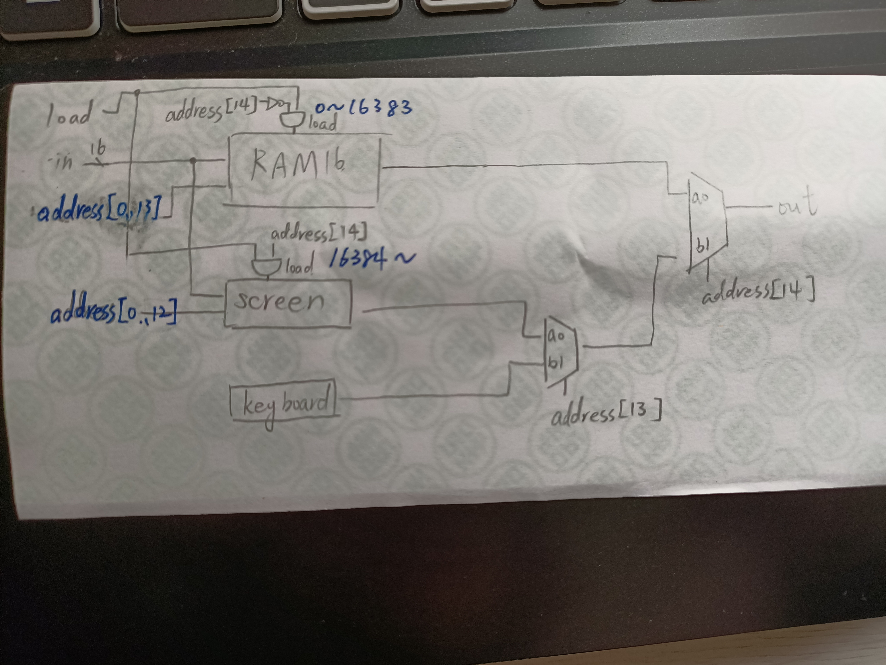

# memory
## 參考資料
    https://drive.google.com/file/d/1nEptWuRpFF9zmqlKYq6s1UfDB_dd16vx/view
    程式碼與圖皆自己畫，不懂的地方有參考這位同學的 : https://github.com/stereomp3/co110a/tree/master/homework/week09
## 筆記


## 作業

```hdl
CHIP Memory {
    IN in[16], load, address[15];
    OUT out[16];
    
    PARTS:
    // Put your code here:
    Not(in=address[14],out=not14);
    And(a=not14,b=load,out=RamLoad);
    RAM16K(in = in, address = address[0..13], load = RamLoad, out = RamOut);

    And(a=load,b=address[14],out=screenLoad);
    Screen(in = in, address = address[0..12], load = screenLoad, out = screenOut);

    Keyboard(out=keyOut);

    Mux16(a=screenOut,b=keyOut,sel=address[13],out=SKselection);
    Mux16(a=RamOut,b=SKselection,sel=address[14],out=out);
}
```

# computer
## 參考資料
[nand2tetris ch5 计算机体系结构](https://4eay7lab.com/2019/07/09/nand2tetris-5/)
https://drive.google.com/file/d/1nEptWuRpFF9zmqlKYq6s1UfDB_dd16vx/view
## 筆記
![CPU&Memory]](./pkkk.png)
CPU执行指令存储器中的指令，而数据存储器和指令存储器分别为RAM和ROM
## 作業

```hdl
CHIP Computer {
    IN reset;
    PARTS:
    // Put your code here:
    //ROM做指令儲存，向CPU輸出指令
    ROM32K(address=pc, out=instruction);
    //memory做數據儲存，向CPU輸出數據
    Memory(in=CpuOutM, load=CPUwriteM, address=CPUaddrM, out=inM);
    //CPU做指令與數據處理
    CPU(inM=inM,instruction=instruction, reset=reset, outM=CpuOutM, writeM=CPUwriteM, addressM=CPUaddrM, pc=pc);
}
```


